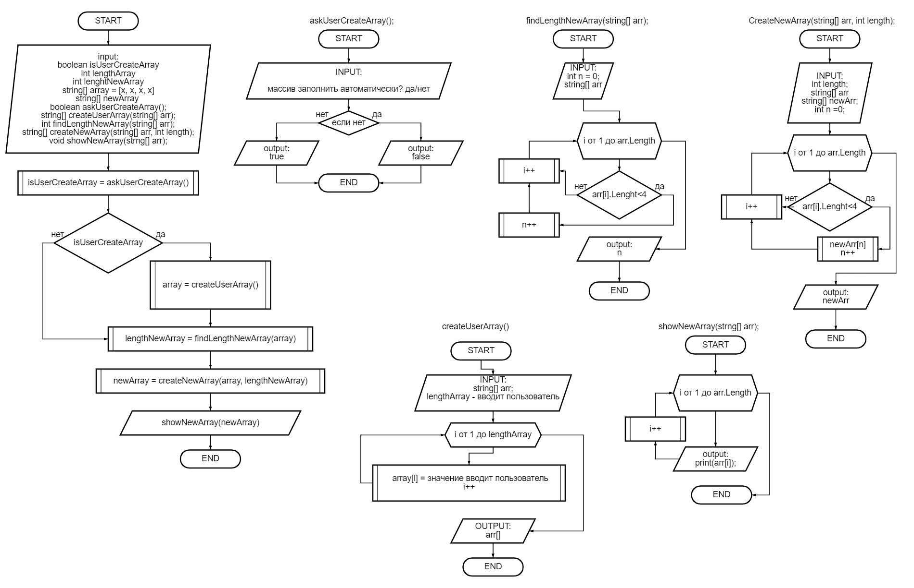

## **Итоговая проверочная работа**
Данная работа необходима для проверки ваших знаний и навыков по итогу прохождения первого блока обучения на программе разработчик. Мы должны убедиться, что базовое знакомство с it прошло успешно.

Задача алгоритмическа не самая сложная, однако для полноценного выполнения проверочной работы необходимоЖ

1. Создать репозиторий на GitHub.
2. Нарисовать блок-схему алгоритма (можно обойтись блок-схемой основной содержательной части, если вы выделяете ее в отдельный метод).
3. Снабдить репозиторий оофрмленным текстовым описанием решения (файл README.md)/
4. Написать прорамму, решающую поставленную задачу.
5. Использовать контролб версий в работе над этим небольшим проектом (не должно быть так что все залито одним коммитом, как минимум этапы 2, 3 и 4 должны быть раположены в разных коммитах)

****
**_Задача:_** Написать программу, которая из имеющегося массива строк формирует массив из строк, длина которых меньше либо равна 3 символа. Первоначальный массив можно ввести с клавиатуры, либо задать на старте выполнения алгоритма. При решении не рекоммендуется пользоваться коллекциями, лучше обойтись исключительно массивами.

**_Примеры:_** 

["hello", "2", "world", ":-)"] -> ["2", ":-)"]

["1234", "1567", "-2", "computer science"]->["-2"]

["Russia", "Denmark", "Kazan"]->[]

****
## _Составление алгоритма_
1. Спросить пользователя хочет ли он заполнить массив? д/н.
2. Если пользователь не хочет заполнять массив, то используются значения по умолчанию и запускаем программу
3. Если пользователь согласился заполнить массив, тогда запрашиваем количество значений, которое он захочет ввести и предлагаем по очердно ввести значения, введенными данными заполняем массив и далее запускаем программу.
4.  Выполнение программы

5. Далее, при выполнении программы проверяем каждый строковый элемент массива на его длину, при выявлении элемента массива, удовлетворяющих условию задача, подсчитываем количество этих элементов и возвращаем **count** количество элементов, удовлетворяющих условию задачи. 
6. После получения количества элементов, создаем незаполненый массив с количеством элементов, найденым ранее. В исходном массиве снова проверяем каждый элемент, при выявлении элемента массива, удовлетворяющего условиям задачи, его значение присваиваем первому элементу нового массива. При нахождении следующего элемента массива, присваиваем это значение следующему эле енту нового массива и так до тех пор, пока не проверим все элементы исходного массива. 
7. После проверки исходного массива и заполнения нового массива, элементами удовлетворяющим условиям задачи.
Выводим новый массив по-элементно. 

На данном рисунке предоставлен алгоритм выполнения задачи:

